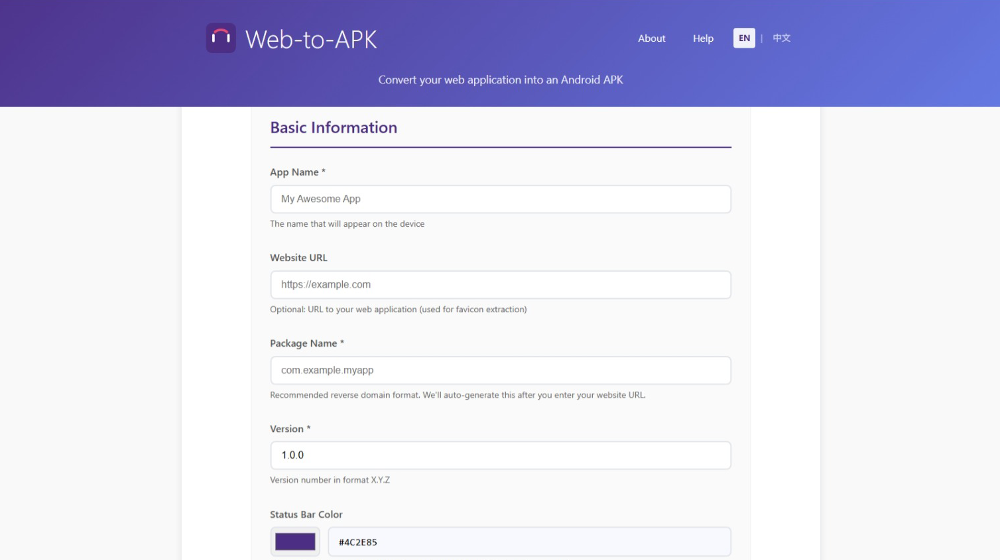

# Web-to-APK

A powerful tool to quickly convert any website into Android APK applications. Supports both command-line interface and web interface, making it easy to package web applications into native Android apps.

## 🚀 Live Demo

**Try Web-to-APK online:** [https://webtoapk.rerebot.com](https://webtoapk.rerebot.com)

Experience the full functionality without any installation - just upload your website URL and download your APK!

## Table of Contents

- [Live Demo](#-live-demo)
- [Screenshots](#-screenshots)

- [Overview](#overview)
- [Features](#features)
- [System Requirements](#system-requirements)
- [Installation](#installation)
- [Quick Start](#quick-start)
- [CLI Usage](#cli-usage)
- [Web Interface](#web-interface)
- [Configuration](#configuration)
- [Troubleshooting](#troubleshooting)
- [Contributing](#contributing)
- [Roadmap](#-roadmap)
- [License](#license)

## 📸 Screenshots



## Overview

### Project Origin: Giving Web Apps a Native Soul in the AI Era

In an age where AI-assisted development is taking the world by storm, anyone can rapidly build powerful web applications using excellent workflow and Agent platforms like n8n, Coze, and Flowise. However, the entry point to these applications is often a long, complex, and hard-to-remember URL.

We believe that a truly great tool deserves a permanent and convenient home on the user's home screen, just like a native app.

This is why we created Web-to-APK. Its mission is simple: to empower every creator to effortlessly convert their workflows, AI Agents, or any beloved website into an installable Android APK in under two minutes, ensuring their brilliant ideas are securely and accessibly "in the pocket."

### Why Reinvent the Wheel?

We noticed a common dilemma among similar tools on the market: the best products often demand complex environment setup and parameter configuration, posing a high technical barrier. Meanwhile, simpler alternatives frequently overlook the critical "app signing" step, producing APKs that are not only a security risk but are also often rejected by modern smartphone operating systems.

### The Web-to-APK Philosophy: A Perfect Balance Between "Simple" and "Powerful"

**For the everyday user**, it's as simple as entering an app name and a URL to generate a standard, installable APK in one click.

**For the professional developer**, it's powerful enough. You can upload your own Keystore file to generate officially signed, release-ready APKs that meet Google Play standards, ready to be confidently distributed on any major app platform.

We hope Web-to-APK becomes your most reliable bridge connecting web creativity to the mobile world in this AI era.

### Key Advantages

- **Dual Interface**: Supports both command-line and web interface operations
- **Fast Building**: Efficient build process based on Capacitor
- **Flexible Configuration**: Rich configuration options to meet different needs
- **Native Experience**: Generated APKs provide native app performance and experience
- **Secure & Reliable**: Built-in security checks and error handling mechanisms

## Features

### CLI Mode Features

- **Project Initialization**: Quickly create project configuration files
- **One-Click Build**: Automated APK build process
- **Local Service**: Launch web interface for visual operations
- **Configuration Validation**: Intelligent configuration file validation
- **Build Logging**: Detailed build process recording and error reporting

### Web Interface Features

- **Visual Configuration**: Intuitive form interface for app configuration
- **Icon Upload**: Support drag-and-drop custom app icon upload
- **Release APK Building**: Support keystore file upload, signing password configuration, and signed APK generation
- **Real-time Preview**: Instant preview of app configuration effects
- **Build Monitoring**: Real-time build progress and status display
- **One-Click Download**: Direct APK file download after build completion

### Core Technical Features

- **Smart Icon Processing**: Automatically generate multiple sizes of app icons
- **Splash Screen Generation**: Create adaptive splash screens for different screen sizes
- **WebView Optimization**: Mobile-optimized WebView configuration
- **Network State Handling**: Intelligent network connection and offline state management
- **APK Signing**: Support for both debug and release version APK signing
- **Release Building**: Complete release APK build process with keystore management and secure signing

## System Requirements

- **Node.js**: Version 20.0 or higher (recommended)
- **npm**: Version 8.0 or higher
- **Java JDK**: Version 17 or higher
- **Android SDK**: API Level 24 or higher
- **Gradle**: Version 8.0 or higher

## Installation

### Recommended: WSL 2 Environment Setup

**We strongly recommend using WSL 2 (Windows Subsystem for Linux) for development**, as it provides the best compatibility and performance.

#### Step 1: Install WSL 2 and Ubuntu

```bash
# Run in Windows PowerShell (Administrator)
wsl --install -d Ubuntu-22.04
```

#### Step 2: Set up Development Environment in WSL Ubuntu

```bash
# Update system
sudo apt update && sudo apt upgrade -y

# Install Node.js 20 using nvm (recommended)
curl -o- https://raw.githubusercontent.com/nvm-sh/nvm/v0.39.0/install.sh | bash
source ~/.bashrc
nvm install 20
nvm use 20

# Install Java 17
sudo apt install openjdk-17-jdk -y

# Set environment variables
echo 'export JAVA_HOME=/usr/lib/jvm/java-17-openjdk-amd64' >> ~/.bashrc
echo 'export PATH=$PATH:$JAVA_HOME/bin' >> ~/.bashrc
source ~/.bashrc
```

#### Step 3: Install Android SDK

```bash
# Create Android SDK directory
mkdir -p ~/android-sdk/cmdline-tools

# Download Android command line tools
cd /tmp
wget https://dl.google.com/android/repository/commandlinetools-linux-9477386_latest.zip
unzip commandlinetools-linux-9477386_latest.zip
mv cmdline-tools ~/android-sdk/cmdline-tools/latest

# Set Android environment variables
echo 'export ANDROID_SDK_ROOT=$HOME/android-sdk' >> ~/.bashrc
echo 'export ANDROID_HOME=$HOME/android-sdk' >> ~/.bashrc
echo 'export PATH=$PATH:$ANDROID_SDK_ROOT/cmdline-tools/latest/bin:$ANDROID_SDK_ROOT/platform-tools' >> ~/.bashrc
source ~/.bashrc

# Install necessary Android SDK components
yes | sdkmanager --licenses
sdkmanager "platform-tools" "platforms;android-35" "build-tools;34.0.0"
```

#### Step 4: Install Web-to-APK

```bash
# Clone the project
git clone https://github.com/RereBot/web-to-apk.git
cd web-to-apk

# Install dependencies
npm install

# Build the project
npm run build

# Install web server dependencies
npm run web-server:install
```

### Alternative: Traditional Environment Setup

For users who prefer not to use WSL, you can set up the environment directly on Windows, macOS, or Linux:

#### Windows

```powershell
# Install Node.js 20 from https://nodejs.org/
# Install Java JDK 17 from https://adoptium.net/
# Install Android Studio from https://developer.android.com/studio

# Set environment variables
$env:JAVA_HOME = "C:\Program Files\Eclipse Adoptium\jdk-17.0.x-hotspot"
$env:ANDROID_HOME = "C:\Users\$env:USERNAME\AppData\Local\Android\Sdk"
```

#### macOS

```bash
# Install Homebrew if not already installed
/bin/bash -c "$(curl -fsSL https://raw.githubusercontent.com/Homebrew/install/HEAD/install.sh)"

# Install Node.js 20
brew install node@20

# Install Java 17
brew install openjdk@17

# Install Android SDK
brew install --cask android-studio
```

#### Linux (Ubuntu/Debian)

```bash
# Install Node.js 20 using nvm
curl -o- https://raw.githubusercontent.com/nvm-sh/nvm/v0.39.0/install.sh | bash
source ~/.bashrc
nvm install 20
nvm use 20

# Install Java 17
sudo apt install openjdk-17-jdk -y

# Install Android SDK
sudo apt install android-sdk -y
```

## Quick Start

### Using Web Interface (Recommended for Beginners)

1. **Start the web server**:
   ```bash
   # Simple direct start (recommended for development)
   node web-server/server.js
   
   # Or using npm script
   npm run web-server
   ```

2. **Open your browser** and navigate to `http://localhost:3000`

3. **Configure your app**:
   - Enter app name and package name
   - Provide the website URL you want to convert
   - Upload a custom icon (optional)
   - Configure advanced settings if needed

4. **Build APK**:
   - Click "Build APK" for debug version
   - Or check "Create Release Version" and upload keystore for signed APK

5. **Download**: Once build completes, download your APK file

### Using CLI

1. **Initialize a new project**:
   ```bash
   npx web-to-apk init my-app
   ```

2. **Configure your app** by editing `web-to-apk.config.json`:
   ```json
   {
     "appName": "My Awesome App",
     "packageName": "com.example.myapp",
     "version": "1.0.0",
     "websiteUrl": "https://example.com",
     "icon": "./icon.png"
   }
   ```

3. **Build APK**:
   ```bash
   npx web-to-apk build
   ```

4. **Find your APK** in the `dist` folder

## CLI Usage

### Commands

- `web-to-apk init [project-name]` - Initialize a new project
- `web-to-apk build [options]` - Build APK from configuration
- `web-to-apk serve [options]` - Start web interface server

### Options

- `--config <path>` - Specify configuration file path
- `--output <path>` - Specify output directory
- `--release` - Build release version (requires signing configuration)
- `--verbose` - Show detailed build logs

### Examples

```bash
# Initialize with interactive setup
web-to-apk init --interactive

# Build with custom config
web-to-apk build --config ./my-config.json

# Build release version
web-to-apk build --release --verbose

# Start web server on custom port
web-to-apk serve --port 8080
```

## Web Interface

The web interface provides a user-friendly way to configure and build APKs:

### Features

- **Drag & Drop Icon Upload**: Easy icon management
- **Real-time Validation**: Instant feedback on configuration
- **Build Progress Tracking**: Live build status updates
- **Release Signing**: Secure keystore upload and signing
- **Multi-language Support**: English and Chinese interfaces

### Release APK Building

For production-ready APKs:

1. Check "Create Release Version"
2. Upload your keystore file (.keystore or .jks)
3. Enter keystore password and key alias
4. Enter key password (if different from keystore password)
5. Build and download signed APK

## Configuration

### Basic Configuration

```json
{
  "appName": "My App",
  "packageName": "com.example.myapp",
  "version": "1.0.0",
  "websiteUrl": "https://example.com",
  "icon": "./icon.png"
}
```

### Advanced Configuration

```json
{
  "appName": "My Advanced App",
  "packageName": "com.example.myadvancedapp",
  "version": "1.0.0",
  "websiteUrl": "https://example.com",
  "icon": "./icon.png",
  "splashScreen": {
    "backgroundColor": "#ffffff",
    "showSpinner": true
  },
  "webView": {
    "allowsInlineMediaPlayback": true,
    "allowsBackForwardNavigationGestures": true
  },
  "permissions": [
    "INTERNET",
    "ACCESS_NETWORK_STATE",
    "CAMERA"
  ],
  "orientation": "portrait"
}
```

### Configuration Options

| Option | Type | Description | Default |
|--------|------|-------------|---------|
| `appName` | string | Display name of the app | Required |
| `packageName` | string | Android package name (must be unique) | Required |
| `version` | string | App version | Required |
| `websiteUrl` | string | URL of the website to convert | Required |
| `icon` | string | Path to app icon | Auto-fetch favicon |
| `splashScreen.backgroundColor` | string | Splash screen background color | `#ffffff` |
| `webView.allowsInlineMediaPlayback` | boolean | Allow inline media playback | `true` |
| `permissions` | array | Android permissions | `["INTERNET"]` |
| `orientation` | string | Screen orientation | `portrait` |

## Troubleshooting

### Common Issues

#### Build Fails with "Java not found"

**Solution**: Ensure Java JDK 17+ is installed and JAVA_HOME is set:

```bash
# Check Java installation
java -version

# Set JAVA_HOME (Linux/macOS)
export JAVA_HOME=/usr/lib/jvm/java-17-openjdk-amd64

# Set JAVA_HOME (Windows)
set JAVA_HOME=C:\Program Files\Eclipse Adoptium\jdk-17.0.x-hotspot
```

#### Android SDK not found

**Solution**: Install Android SDK and set ANDROID_HOME:

```bash
# Set ANDROID_HOME (Linux/macOS)
export ANDROID_HOME=$HOME/android-sdk

# Set ANDROID_HOME (Windows)
set ANDROID_HOME=C:\Users\%USERNAME%\AppData\Local\Android\Sdk
```

#### Gradle build fails

**Solution**: 
1. Clean Gradle cache: `./gradlew clean`
2. Check network connection
3. Ensure sufficient disk space
4. Try building with `--verbose` flag for detailed logs

#### Port 3000 already in use

**Solution**: Use a different port:

```bash
npm run web-server -- --port 8080
```

### Getting Help

- Check our [Issues](https://github.com/RereBot/web-to-apk/issues) page
- Read the [Troubleshooting Guide](docs/troubleshooting.md)
- Join our community discussions

## Contributing

We welcome contributions! Please see our [Contributing Guide](CONTRIBUTING.md) for details.

### Development Setup

```bash
# Clone the repository
git clone https://github.com/RereBot/web-to-apk.git
cd web-to-apk

# Install dependencies
npm install

# Build the project
npm run build

# Run tests
npm test

# Start development server
npm run dev
```

### Code Style

- Use TypeScript for new code
- Follow ESLint configuration
- Write tests for new features
- Update documentation

## 🗺️ Roadmap

### Upcoming Features

- **Docker Support** - Coming Soon! 🐳
  - Complete Docker containerization for easy deployment
  - Docker Compose setup for development environment
  - Pre-built Docker images for production use

- **iOS Support** - Planned for v2.0
  - Convert websites to iOS applications
  - Unified build process for both Android and iOS

- **Cloud Build Service** - Future Release
  - Online APK building without local environment setup
  - Faster build times with cloud infrastructure

- **Plugin System** - Under Consideration
  - Extensible architecture for custom functionality
  - Community-contributed plugins

### Completed Features ✅

- ✅ Web Interface for easy APK building
- ✅ CLI tool for automated workflows
- ✅ Release APK signing support
- ✅ Multi-language support (English/Chinese)
- ✅ Real-time build progress tracking

## License

This project is licensed under the MIT License - see the [LICENSE](LICENSE) file for details.

## Acknowledgments

- Built with [Capacitor](https://capacitorjs.com/)
- Powered by [Node.js](https://nodejs.org/)
- UI components from modern web standards

---

**Made with ❤️ by [RereBot.com](https://www.rerebot.com)**

For more information, visit our [GitHub repository](https://github.com/RereBot/web-to-apk).